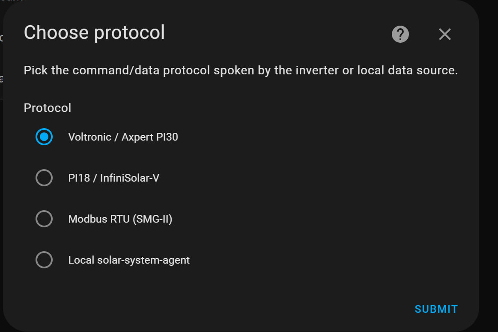
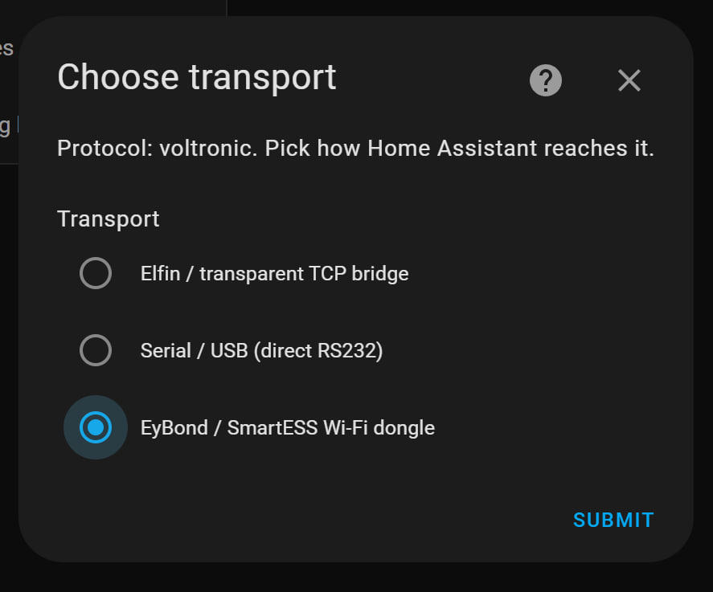
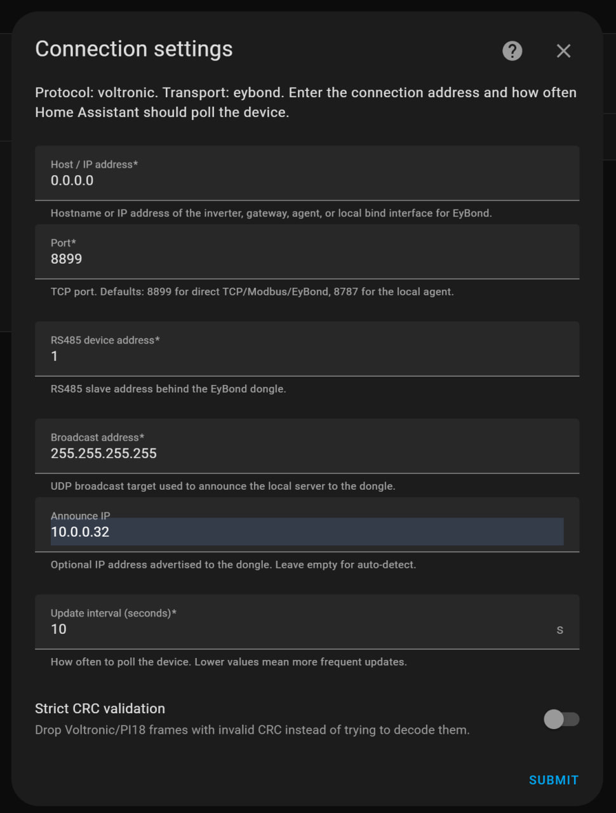

# EyBond / SmartESS Wi-Fi Dongle Transport Setup

This guide explains how to configure the **EyBond / SmartESS Wi-Fi dongle**
transport in the DESS Monitor Local Home Assistant integration.

EyBond works differently from a normal TCP bridge: the dongle connects back to
Home Assistant. Because of that, Home Assistant must be reachable from the
dongle on the configured TCP port.

## Requirements

- DESS Monitor Local updated to a version that includes the separate
  **Protocol** and **Transport** setup steps.
- Home Assistant and the EyBond dongle are on the same local network, or the
  dongle can reach the Home Assistant host IP.
- Incoming TCP connections to the selected port are allowed.

Default port: `8899`.

If Home Assistant runs in Docker, publish this port in `docker-compose.yml`:

```yaml
services:
  homeassistant:
    ports:
      - "8899:8899/tcp"
```

If Home Assistant runs directly on a server, make sure the OS firewall allows
incoming TCP connections on `8899`.

## Install the Update

Install or update **DESS Monitor Local** from the branch that contains the new
transport selection flow. Then restart Home Assistant or reload the custom
integration so the new config flow is loaded.

## Setup Steps

Open Home Assistant:

**Settings -> Devices & Services -> Add Integration -> DESS Monitor Local**

### 1. Choose Protocol

Select **Voltronic / Axpert PI30**.



### 2. Choose Transport

Select **EyBond / SmartESS Wi-Fi dongle**.



### 3. Configure Connection Settings



Fields:

- **Host / IP address**: local bind address for the TCP listener.
  Use `0.0.0.0` unless you need to bind to one specific interface.
- **Port**: TCP listener port. Default is `8899`.
- **RS485 device address**: inverter address behind the dongle. Default is `1`.
- **Broadcast address**: UDP broadcast target used to announce Home Assistant
  to the dongle. Usually leave `255.255.255.255`. If you know your subnet
  broadcast address, you may set it explicitly, for example `10.0.0.255`.
- **Announce IP**: the most important field. Set it to the IP address of the
  server running Home Assistant, as seen from the dongle.

Example:

```text
Home Assistant server IP: 10.0.0.32
Port: 8899
Announce IP: 10.0.0.32
```

After submitting the form, wait **30-60 seconds** for the first dongle
connection and initial data update.

## How EyBond Connectivity Works

The integration starts a local TCP listener on the configured port and sends a
UDP announcement to the dongle. The announcement tells the dongle where to
connect:

```text
set>server=<Announce IP>:<Port>;
```

For the example above:

```text
set>server=10.0.0.32:8899;
```

This is why the **Announce IP** must be the real LAN IP of the Home Assistant
host, not a Docker container IP.

## Docker Notes

For Docker installations, two things must be true:

1. The TCP port is published from the container to the host.
2. **Announce IP** is set to the host LAN IP, not the container IP.

Minimal example:

```yaml
services:
  homeassistant:
    image: ghcr.io/home-assistant/home-assistant:stable
    network_mode: bridge
    ports:
      - "8123:8123/tcp"
      - "8899:8899/tcp"
    volumes:
      - ./config:/config
    restart: unless-stopped
```

If you use `network_mode: host`, port publishing is not needed, but the port
still must be free on the host.

## Troubleshooting

If the integration does not receive data:

- Verify that the Home Assistant host listens on the configured port.
- Verify that no other process uses port `8899`.
- Check that the dongle can reach the **Announce IP**.
- Try leaving **Broadcast address** as `255.255.255.255`.
- Wait at least 60 seconds after saving settings.

Enable debug logs in `configuration.yaml`:

```yaml
logger:
  default: warning
  logs:
    custom_components.dess_monitor_local: debug
    custom_components.dess_monitor_local.api.protocols.eybond_dongle: debug
```

Restart Home Assistant or reload YAML logging configuration, reproduce the
problem, and attach the relevant logs when reporting an issue.

Useful log lines to look for:

- `EyBond: starting TCP listener`
- `EyBond: TCP listener READY`
- `EyBond: UDP announcer START`
- `EyBond: dongle CONNECTED`
- `EyBond RX-payload`

## Common Problems

| Symptom | Likely cause |
| --- | --- |
| No dongle connection | Wrong Announce IP, blocked port, or Docker port not published |
| TCP bind failed | Port `8899` is already used by another process |
| Listener starts but no data | Dongle cannot reach Home Assistant or wrong RS485 address |
| Works on host network but not bridge network | Announce IP points to container IP instead of host LAN IP |
